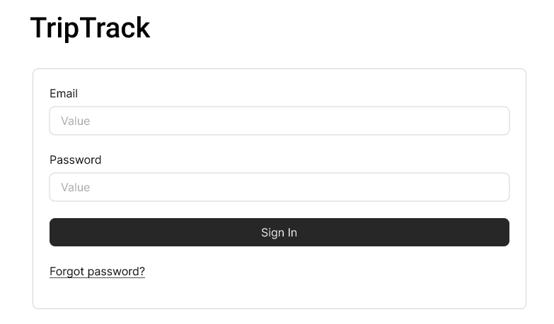
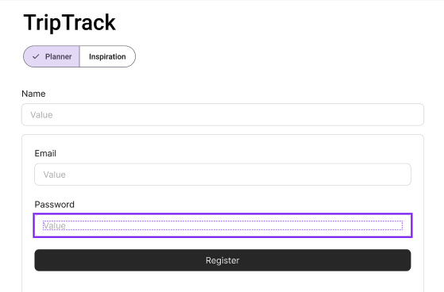
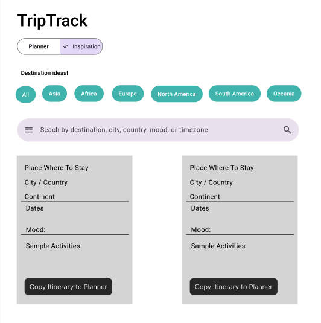
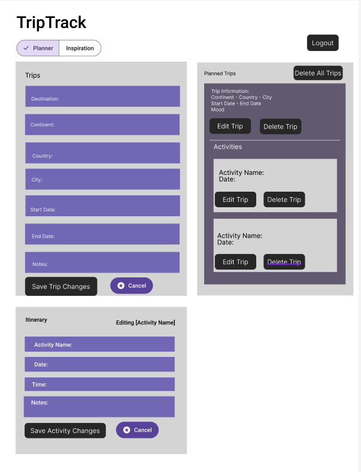
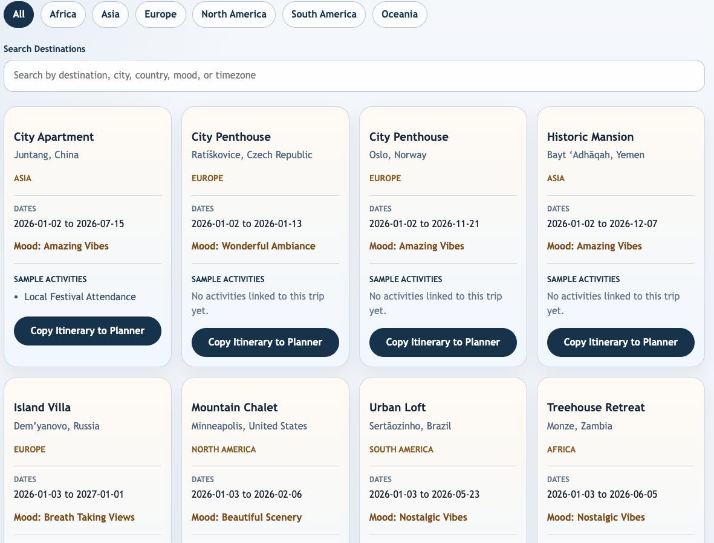
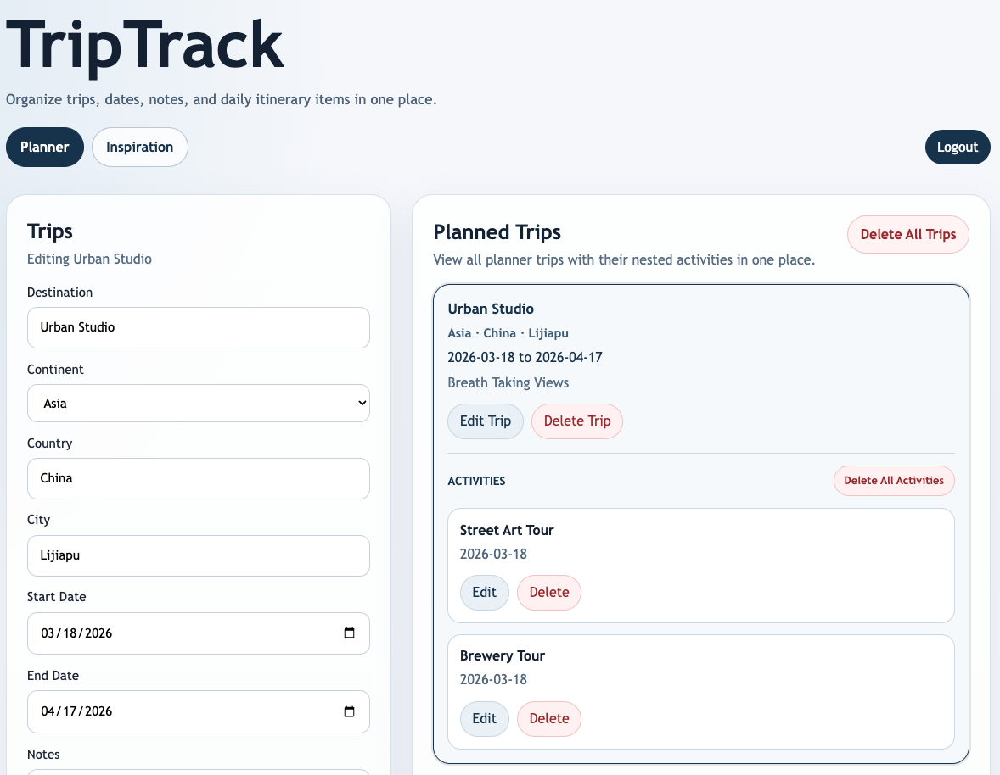

## 1. Project Description

TripTrack is a web application that helps users explore shared travel inspiration and build a private trip planner with itinerary activities.
The app answers the question: "How can I organize trip ideas and turn them into my own travel plan?"

### Core Features

- Public inspiration browsing without login.
- Account-based planner access with registration and login.
- Shared seeded inspiration trips with search, continent filters, and pagination.
- Copy inspiration trips into a private planner.
- Per-user planner trip management (add, edit, delete, delete all).
- Per-user itinerary activity management (add, edit, delete).
- Planner scheduling rules so new trips begin after previously planned trips end.
- Separate local development support with Docker MongoDB and production deployment with MongoDB Atlas and Render.

### Tech Stack

- Frontend: React, Vite, CSS
- Backend: Node.js, Express.js
- Database: MongoDB (local via Docker for development, MongoDB Atlas for deployment)
- Deployment: Render

### Database Schema

The project uses MongoDB collections with a mix of shared seeded data and account-scoped planner data.

#### Collection: `users`

```json
{
  "_id": "ObjectId",
  "name": "string",
  "email": "string",
  "passwordHash": "string",
  "createdAt": "Date"
}
```

#### Collection: `trips`

```json
{
  "_id": "ObjectId",
  "userId": "string | undefined",
  "seeded": "boolean",
  "destination": "string",
  "continent": "string",
  "country": "string",
  "countryCode": "string | undefined",
  "city": "string",
  "timezone": "string | undefined",
  "note": "string | undefined",
  "notes": "string",
  "startDate": "string",
  "endDate": "string",
  "createdAt": "Date",
  "updatedAt": "Date"
}
```

#### Collection: `activities`

```json
{
  "_id": "ObjectId",
  "userId": "string | undefined",
  "tripId": "string",
  "seeded": "boolean",
  "name": "string",
  "description": "string",
  "date": "string",
  "time": "string",
  "createdAt": "Date",
  "updatedAt": "Date"
}
```

## 2. User Personas

1. Frequent Traveler (wants a single place to organize multiple trips each year).
2. Vacation Planner (likes building detailed itineraries before traveling).
3. Casual Traveler (stores trip ideas first, then turns them into concrete plans later).
4. Explorer Without an Account (wants to browse inspiration before signing up).
5. Organized Planner User (wants private planner data that other users cannot edit).

## 3. User Stories

### Ricky's User Stories

- As a user, I want to create a trip with destination and travel dates so I can organize upcoming travel plans.
- As a user, I want to edit or delete my planner trips so my plans stay accurate.
- As a user, I want copied inspiration trips to become my own planner records so I do not modify shared seeded data.
- As a user, I want my planner trips to be scheduled in order so overlapping trip planning is avoided.
- As a user, I want to delete all planner trips at once so I can reset my planner quickly.

### Tarun's User Stories

- As a user, I want to browse public inspiration trips so I can explore destinations before signing in.
- As a user, I want to filter inspiration by continent and search destinations so I can narrow ideas quickly.
- As a user, I want to add itinerary activities to a selected trip so I can plan what I will do.
- As a user, I want to edit or delete itinerary activities so my schedule stays up to date.
- As a user, I want my planner data to be tied to my account so other users cannot edit it.

## 4. Design Mockups

Design mockup files:

- `images/figma_login.png`
  
- `images/figma_register.png`
  
- `images/figma_inspire.png`
  
- `images/figma_planner.png`
  

Current application screenshots:

- `images/inspiraton.png`
  
- `images/planner.png`
  

Figma link:

- https://www.figma.com/proto/87WJ5f5pPp3LbiLmzCsW9T/TripTrack?node-id=0-1&t=ESV9edh2wBW8DOob-1

## 5. Work Distribution

- Ricky:
  - Backend routing and API implementation.
  - MongoDB connection, Docker local database setup, and Atlas deployment setup.
  - Seed script and seeded data integration.
  - Authentication flow and protected planner data logic.
  - Render deployment and production debugging.
- Tarun:
  - UI design direction and frontend interaction design.
  - Inspiration browsing experience and planner UX decisions.
  - Shared frontend/backend feature ideation.
  - Testing, bug fixing, and UI polish support.
